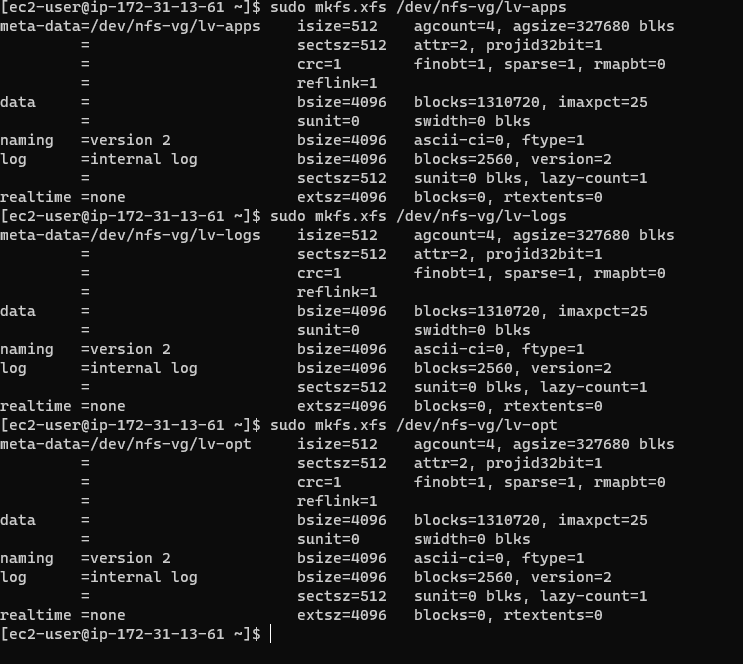

# Documentation of project7
## Step1
1. I opened an EC2 instance on a Red-Hart operating system and i configured LVM on it based on my experience in project 6

    `lsblk`
    `sudo gdisk /dev/xvdb`
    `sudo gdisk /dev/xvdc`

    
    
    

2.  I installed NFS server and configured it.

    `sudo yum -y update`
    
        

3.  I created physical volume

     `sudo pvcreate /dev/xvdb1 /dev/xvdc1`

     

4.  I created the volume group and named it nfs-vg

   `sudo vgcreate nfs-vg /dev/xvdb1 /dev/xvdc1`
   

5.   I created three  logical volumes 

    `sudo lvcreate -n lv-apps -L 5G nfs-vg `
    `sudo lvcreate -n lv-logs -L 5G nfs-vg `
    `sudo lvcreate -n lv-opt -L 5G nfs-vg `

    

6.  I mounted it then I formatted it as xfs

    
    

7.  I tried installing NFS server properly

    `sudo yum -y update`
    `sudo yum install nfs-utils -y`
    `sudo systemctl start nfs-server.service`
    `sudo systemctl enable nfs-server.service`
     `sudo systemctl status nfs-server.service`

    
    

8.  I changed the ownership and mode of the logical volumes
    
    `sudo chown -R nobody: /mnt/apps`
    `sudo chown -R nobody: /mnt/logs`
    `sudo chown -R nobody: /mnt/opt`
    `sudo chmod -R 777: /mnt/apps`
    `sudo chmod -R 777: /mnt/logs`
    `sudo chmod -R 777: /mnt/logs`
     
     

9.  I exported the file server and i checked the port that is being used  by NFS.

    `sudo vi /etc/exports`

     `/mnt/apps <Subnet-CIDR>(rw,sync,no_all_squash,no_root_squash)`
     `/mnt/logs <Subnet-CIDR>(rw,sync,no_all_squash,no_root_squash)`
      `/mnt/opt <Subnet-CIDR>(rw,sync,no_all_squash,no_root_squash)`
    
    

 ## STEP 2
 1.  I installed MYQSL server

 2.  I created  a database and named it 'tooling'

 3.  I created a database user and named it 'webaccess'

 4.  Then I granted permission to the user on the database
    
    
    
## Step3
1. I launched two new EC2 instances for my web servers

2. I installed and verified the required apps on the two web servers

      
    

3. I verified that the apache files and directories are mounted on both the nfs server and the web servers
     
     
      

4.  I installed git and I cloned the repository that I was iven in the guidelines

    `sudo yum install git`
    `git clone <https....>`

    
    
5.  I deployed the tooling website's code to the web server
    
    

6.  I updated the website configuration to connect to the database

7.  I created a new admin user with password in MYSQL

8.  I opened the website in my browser

        

9.  I logged in successfully

    
    

